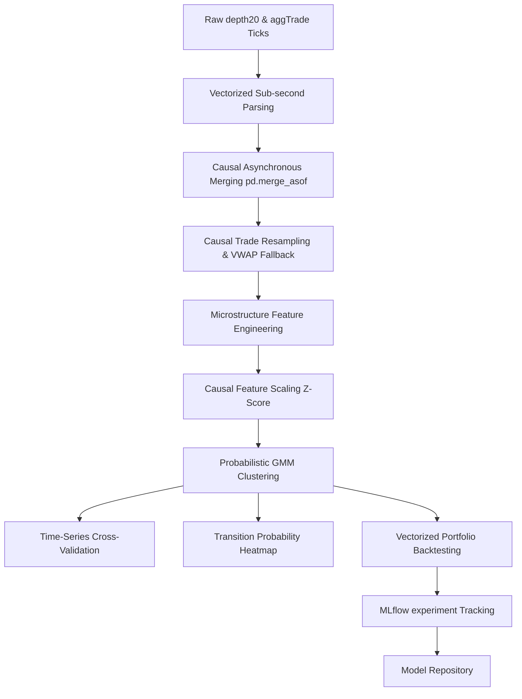

# RegimeRadar: Quantitative Market Regime Detection

RegimeRadar is a high-frequency trading (HFT) analytics and machine learning pipeline designed to parse microsecond-level market execution logs and order book depth states, engineer advanced microstructure features, and classify probabilistic market regimes using Gaussian Mixture Models (GMM).

---

## 📂 Repository Architecture

```filepath
├── config/
│   └── model_config.json          # Decoupled model hyperparameters & features list
├── data/
│   ├── raw/                       # Raw order book and trade execution data (.zip, .txt)
│   └── processed/                 # Processed dataset exports (.csv)
├── notebooks/
│   ├── Week_1/                    # Milestone 1: Basic Python & EDA assignments
│   ├── Week_2/                    # Milestone 2: Order book spread & OBI EDA
│   ├── Week_3/                    # Milestone 3: Primary upgraded HFT ML pipeline (GMM)
│   └── decision_trees/            # Classification assignments
├── src/
│   └── ingestion/
│       └── live_feed.py           # Async WebSocket client streaming live Binance book data
├── tests/
│   └── test_features.py           # Mathematical regression unit testing suite
└── README.md                      # Primary project documentation

```

---

## 🛠️ Operational Workflow & Roadmap



---

## 📈 Microstructure Feature Engineering

The pipeline engineers features directly reflecting order book dynamics:

1. **Volume-Weighted Micro-Price ($P_{\text{micro}}$)**:
   $$P_{\text{micro}} = \frac{P_{\text{bid}} \cdot Q_{\text{ask}} + P_{\text{ask}} \cdot Q_{\text{bid}}}{Q_{\text{bid}} + Q_{\text{ask}}}$$
   Captures immediate pricing pressure within the spread.

2. **Bid-Ask Spread**:
   $$\text{Spread} = P_{\text{ask}} - P_{\text{bid}}$$

3. **Price-Weighted Order Book Imbalance (OBI)**:
   We apply a harmonic decay weight ($W_i = 1/i$) across the top $N$ book levels:
   $$\text{OBI}_N = \frac{\sum_{i=1}^N Q_{\text{bid},i} \cdot W_i - \sum_{i=1}^N Q_{\text{ask},i} \cdot W_i}{\sum_{i=1}^N Q_{\text{bid},i} \cdot W_i + \sum_{i=1}^N Q_{\text{ask},i} \cdot W_i + \epsilon}$$

4. **Rolling VWAP with Division-by-Zero Fallback**:
   $$\text{VWAP} = \frac{\sum P_t \cdot Q_t}{\sum Q_t}$$
   When trading volume is zero, VWAP falls back to the last transaction price.

---

## 🤖 Unsupervised Probabilistic Modeling & MLOps

1. **Gaussian Mixture Model (GMM)**:
   Upgraded from hard-boundary KMeans to GMM (`n_components=4`, `covariance_type='diag'`) to model soft, probabilistic memberships for market states, capturing regime transition uncertainty.
2. **Causal Scaling**:
   Features are normalized using a rolling Z-score lookback (3600 seconds) rather than a global scaler, eliminating future parameter leakage.
3. **TimeSeriesSplit Validation**:
   Validates GMM log-likelihood out-of-sample using chronologically sliced splits to ensure temporal generalization.
4. **Transition Probability Matrix**:
   Calculates the Markovian probability of shifting between regimes to evaluate state persistency:
   $$P_{ij} = \frac{N_{i \to j}}{\sum_k N_{i \to k}}$$
5. **Experiment Tracking**:
   Logs hyperparameters and backtesting metrics dynamically to MLflow under the `RegimeRadar_GMM_Clustering` experiment.

---

## 📊 Strategy Backtesting Metrics

The model maps GMM clusters to directional long/short execution signals. On the local training dataset, the regime-based strategy yields:
- **Annualized Sharpe Ratio**: `8.16`
- **Maximum Drawdown**: `-2.60%`
- **Calmar Ratio**: `68.67`

---

## ⚡ Execution Instructions

### Running the Live Ingestion Client
To connect to the live Binance BNBUSDT exchange WebSocket feed and calculate microstructure features:
```bash
python -m pip install websockets
python src/ingestion/live_feed.py
```

### Running the Regression Test Suite
To run the automated feature verification tests:
```bash
python -m unittest tests/test_features.py
```
